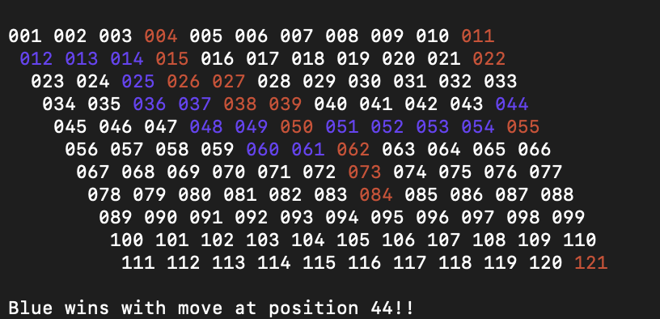

# Hex Game

## Project Information
The goal of this game is to connect one side of the 11x11 board to the other by placing tiles. 
There are two players, the Red Player and Blue Player. Red's goal is to connect the top edge to the bottom edge. 
Blue's goal is to connect the left edge to the right edge. 
Users place tiles by entering the number in the grid of where your tile should be placed. 
Below are two example games where both blue and red win: 

&nbsp;



&nbsp;


&nbsp;

This project uses a disjoint set with path compression in order to compute whether a path has been made from edge to edge.
A Disjoint Set keeps track of a set of elements partitioned into a many smaller sets. Two sets are disjoint if and only if both sets contain unique elements. Ex {1,2,3} and {4,6} are two disjoint sets, where {1,2,3} and {2, 4} are not.

There are two different operations on a disjoint set:

    Union: Union of two sets, in other wrods a merge of the two sets. Ex. {1,2,3} U {4,5} would result into {1,2,3,4,5}
    Find: Used to determine if two elements belong to a particular set or not.

In my implementation of a disjoint set, I structured the disjoint set in form of a tree. Each tree corresponds to one set. Every set has a node which is the parent of the set. Union merges two trees whereas find, seraches a tree for a specified node. My Disjoint set also implements path compression which balances the tree to ensure a branch is not too long(this improves preformance). Using this, each time a tile is played, the program unions all neightbors with the current tile. Then it checks whether both edges are a part of the set using find. If both edges are a part of the same set, then there is a path between the two. The purpose of this project was to demonstrate how a disjoint set can be useful in finding whether a path exists between two points, especially if there are obsticles in the way.


## Build Instructions

1. Build file by running the following command:
```commandline
gradle build
```
2. Then run the program using: 
```commandline
java -jar build/libs/*.jar
```
