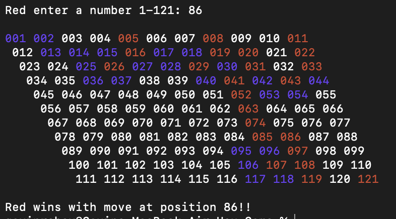

# Hex Game

## Project Information
The objective of the game is to connect one side of the 11x11 board to the opposite side by placing tiles. There are two players: the Red Player and the Blue Player. Red's goal is to connect the top edge to the bottom edge, while Blue's goal is to connect the left edge to the right edge. Players take turns placing tiles by entering the corresponding number for the desired position on the grid. Red player starts the game, and the players continue taking turns until one of them successfully connects their designated edges. If Red player connects the top and bottom edges, Red wins. If Blue player connects the left and right edges, Blue wins. The game ends when one player wins, and the winning player is declared. Example games where both Blue and Red win can be observed: 

&nbsp;


&nbsp;



&nbsp;

This project utilizes a disjoint set data structure with path compression to determine whether a path has been established from one edge to another. In a disjoint set, elements are organized into multiple smaller sets, and two sets are considered disjoint if they do not share any common elements. For instance, {1, 2, 3} and {4, 6} are disjoint sets, while {1, 2, 3} and {2, 4} are not.

There are two different operations on a disjoint set:

    Union: Union of two sets, in other wrods a merge of the two sets. Ex. {1,2,3} U {4,5} would result into {1,2,3,4,5}
    Find: Used to determine if two elements belong to a particular set or not.

In my implementation of a disjoint set, I have organized it in the form of a tree structure, where each tree represents a distinct set. Within each set, there is a designated parent node. The union operation merges two trees together, while the find operation searches for a specific node within a tree. To optimize the performance, I have also implemented path compression, which ensures that the tree remains balanced and prevents any branch from becoming excessively long. This approach is beneficial in terms of efficiency. In the context of the game, every time a tile is played, the program performs a union operation with all neighboring tiles. Then, it uses the find operation to determine if both edges belong to the same set. If this condition is met, it indicates the existence of a path between the two edges. The main purpose of this project was to showcase the usefulness of a disjoint set in identifying whether a path exists between two points, especially when obstacles are present.


## Build Instructions

1. Build file by running the following command:
```commandline
gradle build
```
2. Then run the program using: 
```commandline
java -jar build/libs/*.jar
```
